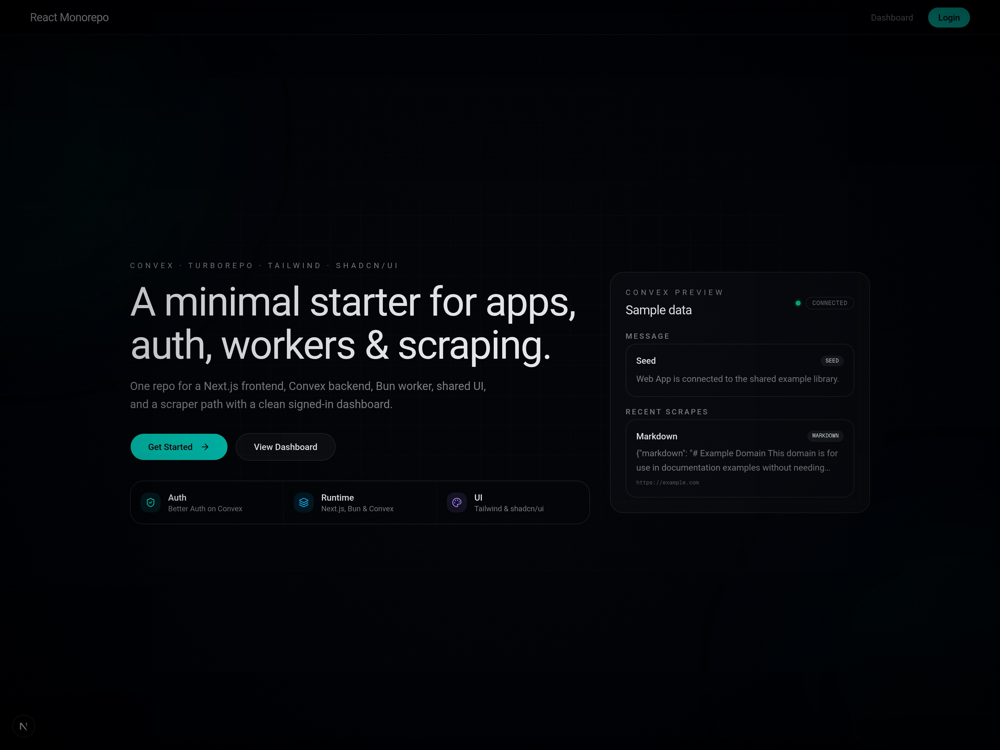
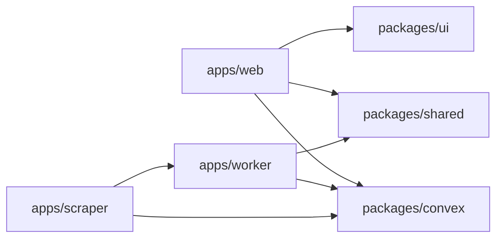

# react-monorepo

A compact full-stack workspace with a Next.js app, a local Convex backend, a Bun worker, and a Crawl4AI scraper.

[](https://github.com/Fractal-Tess/react-monorepo/actions/workflows/lint.yml?query=branch%3Amain+event%3Apush)




## Stack

- `apps/web`: Next.js app wired to Convex through Infisical.
- `apps/worker`: Bun service with a small HTTP health surface.
- `apps/scraper`: Python + Crawl4AI scraper with CSS and LLM extraction modes.
- `packages/convex`: Convex schema, functions, and the seed entrypoint.
- `packages/shared`: shared TypeScript helpers.
- `packages/ui`: shared shadcn/ui component package.



## Quickstart

```bash
bun install
direnv allow
bun run prepare
```

Start the main pieces:

```bash
bun run dev
bun run convex:dashboard
bun run seed
```

For the scraper, enter the Nix shell first so Playwright uses the pinned browser from the flake:

```bash
nix develop
bun run --cwd apps/scraper dev
```

If you want the scraper running too:

```bash
bun run dev:all
```

## Environment

See [docs/environment.md](./docs/environment.md).

## Convex Local Data

Convex recommends two ways to inspect local data:

```bash
bun run convex:dashboard
bun run convex:data
```

Both helpers in this repo explicitly target the local deployment.

## Convex Seeding

Seed the local Convex deployment after `bun run dev` has started Convex:

```bash
bun run seed
```

The seed is idempotent and inserts:

- one welcome message
- one sample scrape run

## Linting

```bash
bun run lint
```

## UI Package

Add shared shadcn components from the web app root:

```bash
pnpm dlx shadcn@latest add button -c apps/web
```

Import them from `@workspace/ui`:

```tsx
import { Button } from "@workspace/ui/components/button"
```
