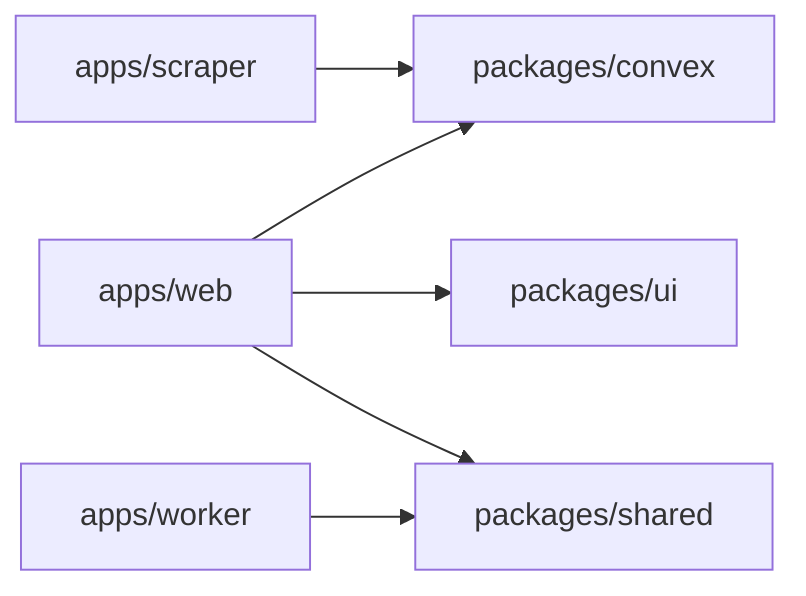

# react-monorepo

A compact full-stack workspace with a Next.js app, a local Convex backend, a Bun worker, and a Crawl4AI scraper.

[](https://github.com/Fractal-Tess/react-monorepo/actions/workflows/lint-web.yml)
[](https://github.com/Fractal-Tess/react-monorepo/actions/workflows/lint-worker.yml)
[](https://github.com/Fractal-Tess/react-monorepo/actions/workflows/lint-scraper.yml)
[](https://github.com/Fractal-Tess/react-monorepo/actions/workflows/lint-convex.yml)
[](https://github.com/Fractal-Tess/react-monorepo/actions/workflows/lint-shared.yml)
[](https://github.com/Fractal-Tess/react-monorepo/actions/workflows/lint-ui.yml)


## Stack

- `apps/web`: Next.js app wired to Convex through Infisical.
- `apps/worker`: Bun service with a small HTTP health surface.
- `apps/scraper`: Python + Crawl4AI scraper with CSS and LLM extraction modes.
- `packages/convex`: Convex schema, functions, and the seed entrypoint.
- `packages/shared`: shared TypeScript helpers.
- `packages/ui`: shared shadcn/ui component package.



## Quickstart

```bash
bun install
direnv allow
bun run prepare
```

Start the main pieces in separate terminals:

```bash
bun run --cwd packages/convex dev
bun run --cwd packages/convex dashboard
bun run --cwd packages/convex seed
bun run --cwd apps/web dev
bun run --cwd apps/worker dev
```

For the scraper, enter the Nix shell first so Playwright uses the pinned browser from the flake:

```bash
nix develop
bun run --cwd apps/scraper dev
```

## Infisical Paths

- `/web`: `CONVEX_URL`, `CONVEX_SITE_URL`
- `/convex`: `CONVEX_URL`, `CONVEX_SITE_URL`
- `/worker`: `CONVEX_URL`, `CONVEX_SITE_URL`
- `/scraper`: `CRAWL4AI_LLM_PROVIDER`, `CRAWL4AI_LLM_API_TOKEN`, `CRAWL4AI_LLM_BASE_URL`

## Convex Seeding

Seed the local Convex deployment after `convex dev --local` is running:

```bash
bun run --cwd packages/convex seed
```

The seed is idempotent and inserts:

- one welcome message
- one sample scrape run

## Linting

Lint is scoped per package and each package has its own GitHub workflow badge.

```bash
bun run --cwd apps/web lint
bun run --cwd apps/worker lint
bun run --cwd apps/scraper lint
bun run --cwd packages/convex lint
bun run --cwd packages/shared lint
bun run --cwd packages/ui lint
```

## UI Package

Add shared shadcn components from the web app root:

```bash
pnpm dlx shadcn@latest add button -c apps/web
```

Import them from `@workspace/ui`:

```tsx
import { Button } from "@workspace/ui/components/button"
```
